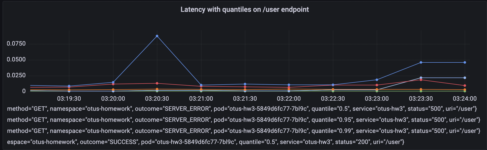
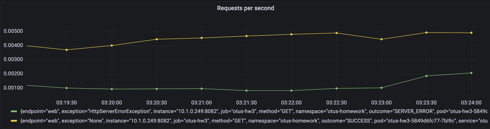
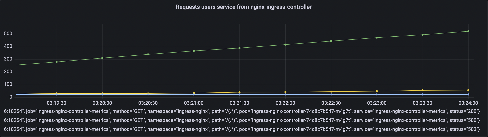
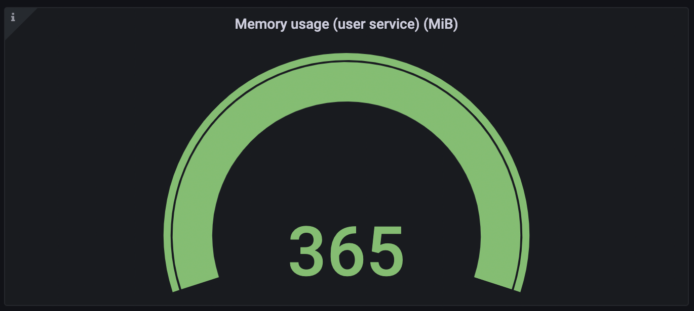
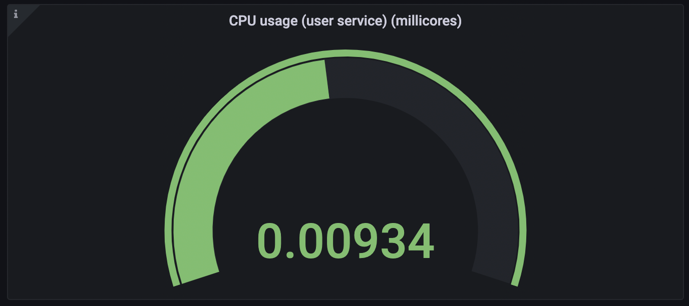
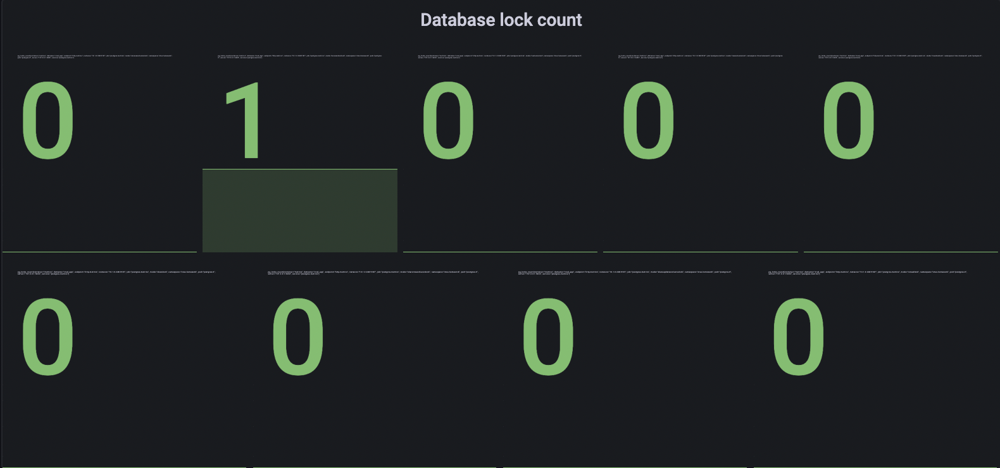

#Steps  

## Upgrade nginx-ingress-controller  
helm upgrade --install ingress-nginx ingress-nginx \  
--repo https://kubernetes.github.io/ingress-nginx \  
--namespace ingress-nginx --create-namespace \  
--set controller.metrics.enabled=true \  
--set-string controller.podAnnotations."prometheus\.io/scrape"="true" \  
--set-string controller.podAnnotations."prometheus\.io/port"="10254" \  
--set controller.metrics.serviceMonitor.enabled=true  

## Install prometheus-stack  
helm repo add prometheus-community https://prometheus-community.github.io/helm-charts  
helm repo update  
helm install -f deploy/prometheus-stack/values.yaml stable-prometheus-stack prometheus-community/kube-prometheus-stack  
kubectl apply -f deploy/grafana/grafana-ingress.yaml -n otus-homework  
kubectl apply -f deploy/prometheus/prometheus-ingress.yaml -n otus-homework  

## Install app  
helm install otus-hw3 ./deploy/otus-hw3 --namespace=otus-homework

## Run locust  
locust --host=http://arch.homework/

## Boards  

